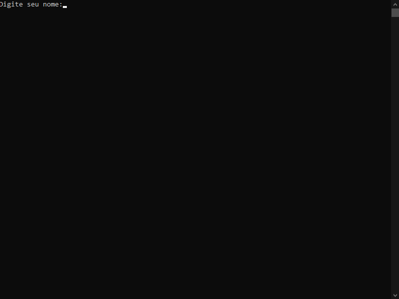

# SomaNotas em linguagem C

Algoritmo para ler duas notas e a partir da soma delas mostrar a mensagem se o aluno foi aprovado ou não. Este algoritmo foi desenvolvido como trabalho do curso programador WEB, IF Goiano.

